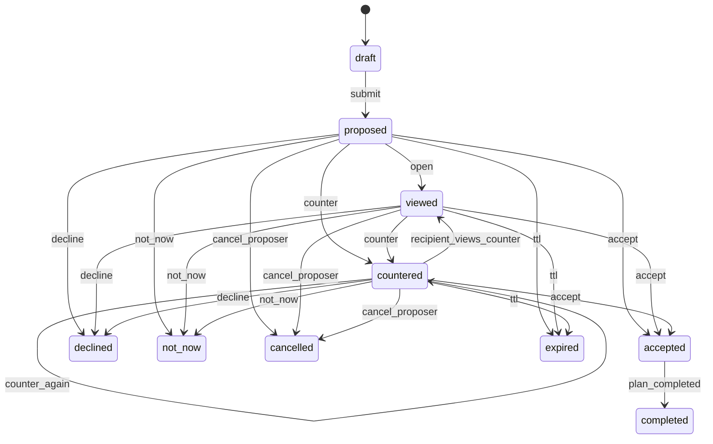

# Date Suggestion — Architecture lock & implementation plan

**Status:** specification only (no implementation in this pass).  
**Grounded in:** current Vibely repo as of audit (web `src/`, native `apps/mobile/`, Supabase `supabase/`).

---

## Part 1 — Codebase audit (touchpoints)

### 1.1 Vibe Schedule (source of truth)

| Area | Location | What exists today |
|------|----------|-------------------|
| **DB** | `public.user_schedules` (`supabase/migrations/20251231001331_0d9fe89a-9ace-48ad-aca1-a41281c247ff.sql`) | `user_id`, `slot_key` (`YYYY-MM-dd_block`), `slot_date`, `time_block` (`morning`…`night`), `status` (`open` / `busy`). RLS: owner CRUD; **matches can SELECT** other participant’s rows (policy `Matched users can view each other schedules`). **Important:** today this is **not time-limited** — the 48h “live share” rule is a **product** requirement that will require **either** a stricter RLS/RPC path **or** UI-only gating (see §6). |
| **Web hook** | `src/hooks/useSchedule.ts` | Loads/updates `user_schedules`; `dateRange` = **next 14 days**; toggles open/busy; roll week via client `upsert`. |
| **Native hook** | `apps/mobile/lib/useSchedule.ts` | Same table contract (parity notes in `apps/mobile/app/schedule.tsx` header). |
| **UI** | `src/components/schedule/VibeSchedule.tsx`, `src/pages/Schedule.tsx` | Web schedule grid + My Dates section. |
| **Native UI** | `apps/mobile/app/schedule.tsx`, `apps/mobile/components/schedule/VibeScheduleGrid.tsx` | Full grid + reminders. |

**Conclusion:** `user_schedules` is the **authoritative** Vibe Schedule store. Any “live schedule share” must **read** this data (never duplicate as a long-lived snapshot in the suggestion row for the 14-day grid; optional ephemeral cache is allowed for performance only).

### 1.2 Existing “date proposal” backend (to replace/extend)

| Area | Location | What exists today |
|------|----------|-------------------|
| **Legacy DB** | `public.date_proposals` (`supabase/migrations/20251228022019_184acae1-ce11-4e1a-be8e-6a031d1d887b.sql`) | Historical contract with `proposer_id`, `recipient_id`, `match_id`, `proposed_date`, `time_block`, `activity`, `status`. Still present for cleanup / legacy paths, but no longer the canonical schedule hub source. |
| **Active chat + planning DB** | `public.date_suggestions`, `public.date_suggestion_revisions`, `public.date_plans` | Server-owned revisioned suggestion flow with accept / decline / counter / cancel and accepted-plan rows. |
| **Native chat** | `apps/mobile/app/chat/[id].tsx` | Uses `DateSuggestionSheet` + `DateSuggestionChatCard` backed by `date_suggestions` / `date_plans`. |
| **Web schedule + native schedule** | `src/hooks/useScheduleHub.ts`, `apps/mobile/lib/useScheduleHub.ts` | Both Schedule hubs now read backend-backed plan buckets from `date_suggestions` / `date_plans` while keeping availability in `user_schedules`. |
| **Cleanup** | `src/hooks/useUnmatch.ts`, `apps/mobile/lib/useUnmatch.ts` | Deletes `date_proposals` for match. |

**Gap:** The repo still carries legacy `date_proposals` cleanup / helper code, but active chat and schedule surfaces are now aligned on the server-owned `date_suggestions` contract. Full legacy cleanup is deferred.

### 1.3 “Vibely Calendar” / My Dates (today)

There is **no** dedicated `calendar_events` or `vibely_calendar` table in migrations reviewed for this audit.

| Concept | Implementation today |
|---------|------------------------|
| **Web “My Dates” / native “My Plans”** | Both Schedule hubs now bucket backend-backed rows into availability, pending, upcoming, and history from `date_suggestions` / `date_plans`. |
| **Reminders** | `useDateReminders` on web and native now computes countdowns from accepted `date_plans` surfaced through `useScheduleHub`. |
| **Event product calendar** | `events` / `event_registrations` — **separate** domain (ticketed events), not match date plans. |

**Conclusion:** The persisted plan model now exists in the active `date_suggestions` / `date_plans` stack, so Schedule can surface real backend-backed plans without introducing a separate calendar schema.

### 1.4 Chat messages schema & rendering

| Item | Detail |
|------|--------|
| **Table** | `public.messages`: `content` text (required), `audio_*`, `video_*`, `read_at`, `created_at`. No `message_type` / `metadata` column in base migrations reviewed. |
| **Web fetch** | `src/hooks/useMessages.ts` — maps `content` → `text`; send via Edge `send-message`. |
| **Native fetch** | `apps/mobile/lib/chatApi.ts` — same columns. |
| **Media hacks** | `apps/mobile/lib/chatMessageContent.ts` — `__IMAGE__\|` prefix for photos (in-band string convention). |
| **Games (web)** | `src/pages/Chat.tsx` — `gameMessages` are **local component state**; **not** written to `messages`. |

### 1.5 Notifications & deep links

| Item | Detail |
|------|--------|
| **Sender** | `supabase/functions/send-notification/index.ts` — OneSignal; maps `notification_type` → `pref_*`; templates include `date_proposal_received`, `date_proposal_accepted`, `date_proposal_declined` (under `pref_messages`). |
| **Chat message push** | `supabase/functions/send-message/index.ts` invokes `send-notification` with `data.url: /chat/${sender_id}`, `match_id`, `sender_id`. |
| **Native routing** | `apps/mobile/components/NotificationDeepLinkHandler.tsx` — `additionalData.url` / `deep_link`; resolves `/chat/:peerProfileId`; foreground suppression when already in that thread (`sender_id` / `other_user_id`). |

### 1.6 Share sheet patterns

| Pattern | File |
|---------|------|
| React Native `Share.share` | `apps/mobile/components/invite/InviteFriendsSheet.tsx`, `ManageBookingModal.tsx` |

Web: use **Web Share API** or copy-to-clipboard where unavailable (to align in implementation phase).

### 1.7 Admin / analytics (relevant)

- **Notification logging:** `notification_log` (referenced in `send-notification`).
- **No** chat-specific PostHog usage found under `**/chat/**` in a quick grep — analytics for the new feature should follow existing project conventions when added.

### 1.8 Web / native chat entrypoints (Suggest a Date)

| Surface | Entry |
|---------|--------|
| **Web Chat** | `src/pages/Chat.tsx` — keyword-triggered `DateSuggestionChip` (“Suggest a Video Date”) + `VibeSyncModal` / schedule modals; not wired to new entity. |
| **Native Chat** | `apps/mobile/app/chat/[id].tsx` — contextual chip “Suggest a Date” → `DateSuggestionSheet`. |

---

## Part 2 — Recommended implementation architecture

### 2.1 Naming: new first-class entity

**Recommendation:** introduce **`date_suggestions`** as the root table (new name avoids overloading legacy `date_proposals` semantics and allows a clean migration path: backfill or deprecate `date_proposals` after cutover).

Alternatively, **evolve** `date_proposals` in place with additive columns + new statuses — only if you want a single migration with fewer tables; the spec below is table-name agnostic.

### 2.2 Root entity / tables (minimum)

1. **`date_suggestions`** (one row per suggestion lifecycle; holds **current** state + denormalized pointers)
   - `id`, `match_id`, `chat_id` optional (match is enough), `proposer_id`, `recipient_id`
   - `status` (enum / text check — see state machine)
   - `current_revision_id` → latest proposal terms
   - `expires_at` (proposal visibility / negotiation SLA — aligns with “48h visibility” for schedule share; suggestion-level expiry separate if needed)
   - `schedule_share_expires_at` (nullable; set when share is active)
   - `created_at`, `updated_at`
   - Unique partial index: **`one active per match`** (see §5)

2. **`date_suggestion_revisions`** (append-only counter history)
   - `id`, `date_suggestion_id`, `revision_number` (int, starts at 1)
   - **Core fields** (versioned): `date_type_key`, `time_choice_key`, `place_mode_key`, `venue_text` (nullable), `optional_message` (nullable), `schedule_share_enabled` (bool)
   - **Resolved scheduling** (for “Pick a time” / concrete instant): `starts_at` / `ends_at` nullable timestamptz, or `time_window` JSON with strict schema
   - `proposed_by` (user id — who authored this revision)
   - `created_at`
   - **Agreed-field snapshot** (optional but useful): `agreed_field_flags` jsonb — computed at counter time (see §6)

3. **`date_suggestion_timeline_messages`** (optional bridge) — **or** use `messages` with typed columns (preferred: single timeline)

### 2.3 Chat timeline representation (no plain-text hacks)

**Recommendation:** extend `public.messages` with a typed message contract:

- Add columns, e.g.  
  - `message_kind` `text` NOT NULL DEFAULT `'text'`  
  - `content` remains for human-readable fallback / search / push preview  
  - `structured_payload` `jsonb` NULL — **only** for kinds that need it  
  - **`ref_id` `uuid` NULL** — FK to `date_suggestions.id` when `message_kind = 'date_suggestion'`

**Rendering rule:** For `message_kind = 'date_suggestion'`, clients **must** render from **`ref_id`** + server-sourced suggestion/revision fetch (or join via RPC), not from parsing `content`. `content` can be a short summary for notifications and legacy tooling.

**Why not only JSON in `content`?** Avoids string parsing, keeps DB constraints and migrations explicit, matches how voice/video use columns today.

**Alternative** (if you strongly want zero `messages` migration in phase 1): parallel **`chat_timeline_items`** table with polymorphic `item_type`. Higher churn; **not recommended** given existing `messages` + realtime.

### 2.4 Confirmed-plan object

**New table: `date_plans`** (or `confirmed_date_plans`)

- `id`, `date_suggestion_id` (nullable after manual plan?), `match_id`, `title` e.g. `Date with {first_name}` stored **or** computed in UI from partner name
- `starts_at`, `ends_at` (timestamptz)
- `venue_label` (text), `activity_label` / `date_type_key`
- `created_at`, `completed_at` (nullable), `cancelled_at` (nullable)
- **Per-user visibility:** either  
  - **Two rows** (`date_plan_participants`: `plan_id`, `user_id`, `confirmation_status`, `calendar_issued_at`) — clear for “either side can complete; other confirms later”, **or**  
  - **One row** + participant subtable (normalized)

**Recommendation:** **one shared `date_plans` row** + **`date_plan_participants`** (two rows per plan) for per-user calendar issuance and completion state.

### 2.5 Calendar issuance model

- On transition to **fully confirmed** (see §3 / §6), server creates `date_plans` + participant rows.
- **“Vibely Calendar”** in-app lists read from **`date_plans`** (joined with match + partner profile), not from free-form messages.
- Optional: `user_calendar_entries` mirror for ICS/export later — **not required at launch** if Schedule page queries `date_plans` directly.

### 2.6 Live schedule sharing model

- **Source of truth:** `user_schedules` (existing).
- **Access control:** new table **`schedule_share_grants`**:
  - `id`, `match_id`, `viewer_user_id`, `subject_user_id`, `created_at`, `expires_at`, `source_date_suggestion_id`, `source_revision_id`
  - RLS: viewer can read grant if `auth.uid() = viewer_user_id` and `expires_at > now()`; subject can insert/revoke via RPC tied to suggestion actions.
- **RPC:** `get_shared_schedule(subject_user_id, match_id)` → returns **only** slots for **next 14 days**, **open/busy** (and time blocks), **no** other profile fields.
- **Live updates:** client subscribes to **Realtime** on `user_schedules` for `subject_user_id` **while** grant valid (or poll every N minutes). When grant expires, subscription stops.

**Privacy:** Never expose reasons, events, or off-app metadata — only **availability blocks** already modeled in `user_schedules`.

### 2.7 Server-owned transitions

**All status changes that affect money, notifications, expiry, or calendar** should go through **Postgres RPC** or **Edge Functions** using **service role**, not direct client `UPDATE` on the suggestion row (except read-only clients).

Suggested split:

| Operation | Mechanism |
|-----------|-----------|
| Create draft / propose | `date_suggestion_create` RPC or `date-suggestion-actions` Edge Function |
| Counter | Same — inserts revision + sets `countered` + computes agreed chips |
| Accept / decline / not_now / cancel | RPC with guards |
| Mark completed / confirm completion | RPC |
| Expire (cron) | Scheduled Edge Function or `pg_cron` calling same code path |

**Idempotency:** use `idempotency_key` on mutations where push notifications fire.

### 2.8 Web / native UI surface map (high level)

| Surface | Purpose |
|---------|---------|
| **Chat thread** | Timeline cards for each revision state; CTA strip: Accept / Counter / Not now / Decline; proposer Cancel (when allowed). |
| **Composer** | Entry “Suggest a date” → full-screen sheet / modal (multi-step: type → time → place → message). |
| **Schedule** | List upcoming **`date_plans`**; link back to chat; show “shared schedule active until …” when grant exists. |
| **Notifications inbox** | Optional deep link to chat + highlight suggestion id. |

---

## Part 3 — Authoritative state machine

Statuses: **`draft` | `proposed` | `viewed` | `countered` | `accepted` | `declined` | `not_now` | `expired` | `cancelled` | `completed`**

Legend:

- **Terminal:** no further status transitions except possibly admin/support.
- **Blocks new suggestion:** see §5.

| Status | Who sets | Valid previous | Terminal | Blocks new? | Calendar | Push |
|--------|----------|----------------|----------|---------------|----------|------|
| `draft` | Proposer (only) | — | No | Yes (while draft exists for match) | No | No |
| `proposed` | System / proposer on submit | `draft` | No | Yes | No | **Yes** — “new suggestion” |
| `viewed` | System (recipient opened thread/card) or explicit API | `proposed`, `countered` | No | Yes | No | No (optional; product says no extra notif for viewed) |
| `countered` | System when recipient submits counter-revision | `proposed`, `viewed` | No | Yes | No | **Yes** — “counter” |
| `accepted` | Recipient explicit action | `proposed`, `viewed`, `countered` | Yes* | No | **Create `date_plans` + issue calendar** | **Yes** — “accepted” |
| `declined` | Recipient | `proposed`, `viewed`, `countered` | Yes | No | No | **Yes** |
| `not_now` | Either side (soft close) | `proposed`, `viewed`, `countered` | Yes | No | No | Optional (map to “declined” preference bucket or separate type) |
| `expired` | System (cron) | `proposed`, `viewed`, `countered` | Yes | No | No | **Yes** — “expiring soon” fires **once** before this; no push on final expire if product prefers silence — **recommend** no push on transition to `expired` if “expiring soon” already sent |
| `cancelled` | Proposer only, **until accepted** | `draft`, `proposed`, `viewed`, `countered` | Yes | No | No | **Yes** |
| `completed` | Either participant (workflow: propose complete → other confirms) | `accepted` (via plan state) | Yes | No | Update plan / hide from “upcoming” | **No** (per product) |

\* **`accepted` is terminal for the suggestion object**; post-accept lifecycle lives on **`date_plans`** (complete/cancel).

**Valid transitions (summary diagram)**

(Adjust loop edges to match whether you allow **multiple counters** — product implies yes.)

---

## Part 4 — One-active-suggestion rule (precise)

Define **blocking** statuses as those where the negotiation **occupies the chat’s single slot**:

**Blocking (cannot create another suggestion in the same `match_id`):**  
`draft`, `proposed`, `viewed`, `countered`

**Non-blocking (new suggestion allowed):**  
`accepted`, `declined`, `not_now`, `expired`, `cancelled`, `completed`

**Enforcement:**

- Partial unique index on `date_suggestions(match_id)` WHERE `status IN ('draft','proposed','viewed','countered')`.
- Server RPC rejects create if index would violate.

**Note:** `draft` should either be **ephemeral** (short TTL) or **auto-cleaned** to avoid a stuck blocking row if the user abandons the composer.

---

## Part 5 — Agreement model (Agreed chips, explicit acceptance)

### 5.1 Core fields (for `Agreed` chips)

| Field | Purpose |
|-------|---------|
| `date_type_key` | Coffee, Drinks, … `custom` |
| `time_choice_key` | Tonight, Tomorrow, … `pick_a_time`, `share_schedule` |
| `place_mode_key` | I’ll choose, Together, Near me, … `custom_venue` |
| `venue_text` | Free-text custom venue (launch: **only** custom place; can be null when not custom) |
| `optional_message` | Auto-filled variants + edit |
| `schedule_share_enabled` | Boolean — whether “Share your Vibe Schedule” is on for this revision |

### 5.2 Counter revision — agreed vs changed

When author **B** submits revision **R_n** in response to **R_{n-1}** authored by **A**:

For each core field `f`:

- If `R_n.f == R_{n-1}.f` → show **`Agreed`** chip for `f` (semantic equality: normalized strings, same enum keys, same instant window for picked time).
- If different → show **new value** for `f`; do **not** label as Agreed.

**No silent auto-acceptance:** moving to `accepted` **only** via explicit **Accept** control after reviewing latest revision.

### 5.3 Acceptance

- **Explicit** tap: “Accept” on latest revision.
- Server validates: `status ∈ { proposed, viewed, countered }`, recipient is actor, sets `accepted`, creates **`date_plans`** + calendar rows, emits timeline message + notification.

---

## Part 6 — Live Vibe Schedule share contract (48h)

### 6.0 Current vs target access

- **Today:** any matched user can `SELECT` their match’s `user_schedules` rows (no expiry).
- **Target:** show shared availability in the date-suggestion flow **only** while `schedule_share_grants` is valid (**48h**).
- **Recommendation:** implement **`get_shared_schedule`** as the **only** supported client path for “partner schedule in date planning,” backed by a grant check; follow-up migration may **replace** the broad “matched users can view each other schedules” policy with grant-scoped access to enforce privacy by default (coordinate with any other screens that relied on direct table reads).

### 6.1 Grant

- Creating or **countering** with `schedule_share_enabled = true` creates/extends **`schedule_share_grants`**:
  - `viewer_user_id` = the **other** match participant
  - `subject_user_id` = sharer
  - `expires_at` = `now() + 48 hours` (server clock)
  - Idempotent upsert per `(match, subject, viewer)` for active suggestion or revision chain

### 6.2 Viewer can see

- For `subject_user_id`, for **rolling next 14 days** from **viewer’s request time** (or calendar UTC days — pick one rule server-side and stick to it):
  - For each `slot_key`: **busy vs open** (and which `time_block` rows exist)
- **Cannot see:** profile fields, other matches, event names, history outside window

### 6.3 Live updates

- Viewer holds realtime channel on `user_schedules` filtered to `user_id = subject_user_id` **while** grant valid.
- On `expires_at`, server returns 403 / empty; client removes schedule UI.

### 6.4 Counter with share

- A counter can toggle share on/off; each revision can **re-issue** grant (new 48h window) — **recommend** resetting `expires_at` on each share-enabled revision from that proposer.

### 6.5 Privacy

- Only **availability** vectors already in `user_schedules`; rate-limit RPC to prevent enumeration.

---

## Part 7 — Chat rendering contract

| Requirement | Decision |
|-------------|----------|
| No raw string encoding | **`messages.message_kind = 'date_suggestion'`** + **`ref_id → date_suggestions.id`** |
| Rich cards web + native | Shared **typed payload** from API: `{ suggestion_id, status, revision, agreed_chips, actions }` |
| History | Each **revision** may insert a **timeline message** row (kind `date_suggestion_event`) **or** a single message row that updates — **prefer** immutable event messages for auditability |

**Do not** rely on `content` prefixes like `📅 Suggested…` for UI logic (legacy native path today — to be deprecated).

---

## Part 8 — Confirmed plan & calendar

### 8.1 Derivation

On **`accepted`**, snapshot from **latest revision**:

- `starts_at` / `ends_at` from resolved time + date type defaults
- `venue_label` from place mode + `venue_text`
- `date_type_key`, optional message as notes

### 8.2 Issuance

- Insert **`date_plans`** + two **`date_plan_participants`** rows.
- **Title:** `Date with {first_name}` — compute from **partner** `profiles.name` (first token).

### 8.3 Cancel / complete

- **Cancel plan:** both can? Product says **completed** is either side marks; other confirms — use **participant flags** `complete_requested_by`, `complete_confirmed_by` or symmetric completion state machine on **`date_plans`** (detail in implementation).
- **Calendar rows:** updating `date_plans` status drives Schedule UI; optional deletion of calendar entries on cancel.

### 8.4 Pattern

**Recommendation:** **One shared `date_plans` row** + **per-user participant rows** (not two unrelated plan rows) to avoid divergence.

---

## Part 9 — Notification model (launch)

Map to `send-notification` with new types (extend `NOTIFICATION_TYPE_TO_PREF` + templates).

| Event | `notification_type` | Recipient | Payload `data` (minimum) | Route |
|-------|---------------------|-----------|----------------------------|-------|
| Suggestion proposed | `date_suggestion_proposed` | Recipient | `match_id`, `other_user_id` (proposer), `date_suggestion_id`, `url: /chat/{proposer_id}` | Chat thread |
| Counter | `date_suggestion_countered` | Other side (counter-author’s match) | `date_suggestion_id`, `other_user_id`, `url` | Chat |
| Accepted | `date_suggestion_accepted` | Proposer | `date_suggestion_id`, `other_user_id`, `url` | Chat |
| Declined | `date_suggestion_declined` | Proposer | same | Chat |
| Cancelled | `date_suggestion_cancelled` | Recipient | same | Chat |
| Expiring soon (once) | `date_suggestion_expiring_soon` | Both or non-acting party per policy | `date_suggestion_id`, `expires_at` | Chat |

**Recipient rules:** always the **other** match participant from actor. **No** notification for `completed` (per product).

**Preference bucket:** start under **`pref_messages`** (or split later); align with existing `date_proposal_*` mapping.

**Deep link:** reuse `NotificationDeepLinkHandler` — ensure payloads include **`sender_id` / `other_user_id`** consistent with `/chat/:profileId`.

---

## Part 10 — Date type catalog & copy variants (launch)

**`date_type_key` enum** — keys for i18n and analytics:

`coffee`, `drinks`, `walk`, `dinner`, `activity`, `event_together`, `video_date`, `concerts`, `night_out`, `brunch`, `cinema_theater`, `gym_date`, `custom`

**Optional message:** 4 variants × distinct tone × date type = **content table** in code or DB (`date_suggestion_copy` seed table). **One preselected** default per type in UI.

---

## Part 11 — Implementation phases (ordered)

### Phase A — Database & RLS

1. Create `date_suggestions`, `date_suggestion_revisions`, `schedule_share_grants`, `date_plans`, `date_plan_participants`.
2. Extend `messages` with `message_kind`, `structured_payload`, `ref_id` (and FK checks).
3. Partial unique index — one active suggestion per match.
4. RLS policies mirroring match participation patterns from `date_proposals` / `messages`.

### Phase B — Server API

1. Edge Function **`date-suggestion-actions`** (or RPC suite): propose, counter, accept, decline, not_now, cancel, expire job, complete-plan hooks.
2. **`get_shared_schedule`** RPC.
3. Wire **`send-notification`** new types + templates.
4. Cron: `expired` transition + **expiring soon** fan-out once.

### Phase C — Web

1. `useMessages` + chat UI: render typed cards for `message_kind`.
2. Replace local-only schedule proposals in `useSchedule` with **`date_plans`** reads where applicable.
3. Composer flow + Schedule integration.

### Phase D — Native

1. Update `apps/mobile/lib/chatApi.ts` + `chat/[id].tsx` to stop plain-text proposal messages; use new API + cards.
2. `DateSuggestionSheet` → full flow; **Share** via `Share.share` for “Share the date”.
3. Notification handler: new categories if needed for foreground suppression.

### Phase E — Deploy & QA

1. Staging migration + backfill strategy for legacy `date_proposals` (optional one-time script).
2. Test matrix: state transitions, RLS, one-active rule, 48h grant expiry, realtime schedule, push deep links, cross-platform threads.

---

## Part 12 — Files/components/tables — audit checklist (definitive list)

| Layer | Artifact |
|-------|----------|
| **DB** | `user_schedules`, `date_proposals`, `messages`, `matches`, `profiles`, `notification_preferences`, `notification_log` |
| **Edge** | `send-message`, `send-notification` |
| **Web** | `src/pages/Chat.tsx`, `src/hooks/useMessages.ts`, `src/hooks/useSchedule.ts`, `src/pages/Schedule.tsx`, `src/components/schedule/*`, `src/components/chat/DateSuggestionChip.tsx` |
| **Native** | `apps/mobile/app/chat/[id].tsx`, `apps/mobile/lib/chatApi.ts`, `apps/mobile/lib/dateProposalsApi.ts`, `apps/mobile/lib/useSchedule.ts`, `apps/mobile/lib/useScheduleProposals.ts`, `apps/mobile/components/chat/DateSuggestionSheet.tsx`, `apps/mobile/components/NotificationDeepLinkHandler.tsx`, `apps/mobile/lib/chatMessageContent.ts` |

---

## Part 13 — User-only actions (cannot be done by Cursor alone)

- **OneSignal / Apple / Google** dashboard configuration for new notification types if your org requires manual template approval.
- **Production cron** scheduling (Supabase dashboard or external) for expiry jobs — unless you add `pg_cron` via migration in repo.
- **Legal/product review** of safety note text in share sheet.

---

*This document is the architecture lock for Date Suggestion; implementation should follow unless product explicitly revises a locked decision.*
